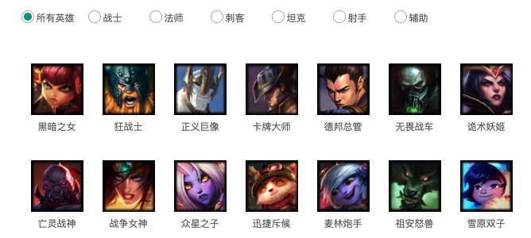
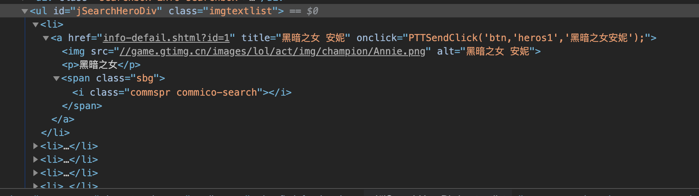
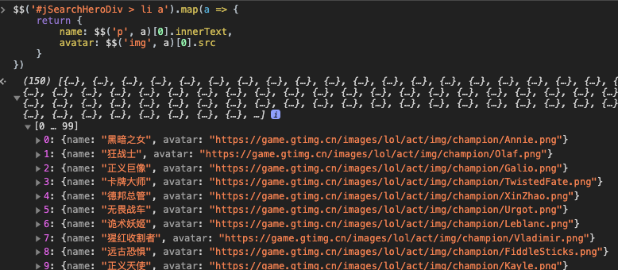
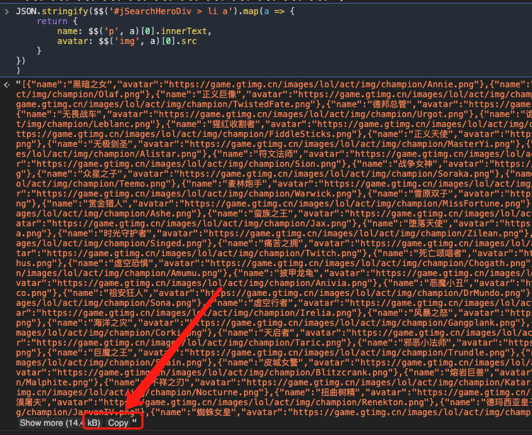
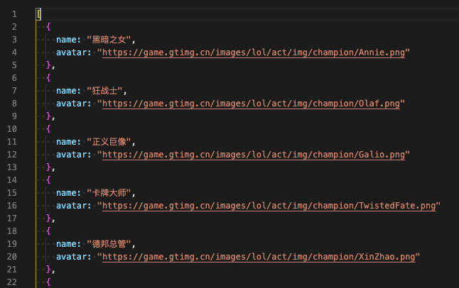

# 通过浏览器爬取数据的一种简便方法

有的时候，我们需要一些数据，这些数据比较简单有规律。我们又不想写专业的爬虫，或者手头条件并不允许的情况下。我们甚至可以仅仅通过浏览器爬取一些数据。这要求对网页结构进行分析，要求一定的`DOM选择器`的知识。这点跟我们之前了解到的`JQuery`选择器非常类似。

区别是，使用`JQuery`，我们需要一个`$`，而通过浏览器的选择器，我们需要两个`$`，即`$$`。

下面进行一下示范：

有如下网页数据，



通过检查页面元素，我们可以得到结构图如下：



我们可以看到所有的数据都存放在一个`ul`里面，这个`ul`刚好是一个`id`选择器。假设我们这里需要获取每一个英雄的头像和名字。

```javascript
$$('#jSearchHeroDiv > li a').map(a => {
  return {
    name: $$('p', a)[0].innerText,
    avatar: $$('img', a)[0].src
  }
})
```

结果如下：



说明：

每次通过`$$`获取到的都是一个数组，`$$('p', a)`表示在`a`标签里面去找`p`

当然了，更多的时候我们是希望把这个结果能保存起来，我们需要方便的复制。而上一步产生的结果没法方便复制。这个时候我们把这个结果转换为字符串。操作如下：

```javascript
JSON.stringify(
  $$('#jSearchHeroDiv > li a').map(a => {
    return {
      name: $$('p', a)[0].innerText,
      avatar: $$('img', a)[0].src
    }
  })
)
```

结果如下：


把这个数据复制到编辑器，然后通过简单格式化一下，就可以得到如下图很漂亮的格式了。

